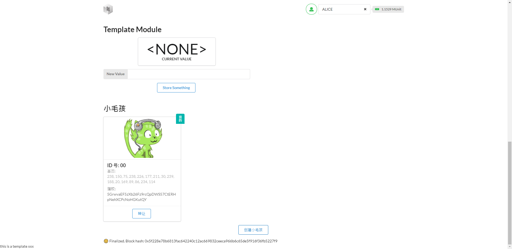
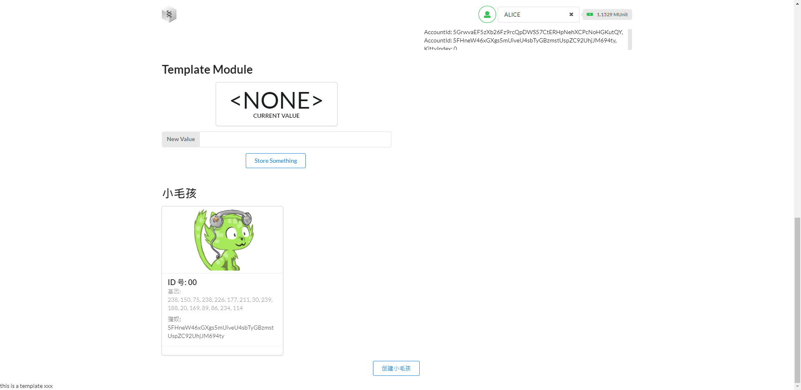
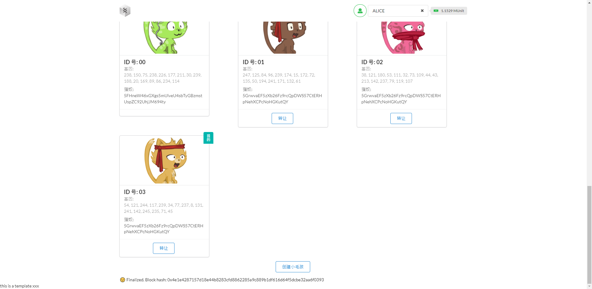

        @Author: 齐毅凡; team-1; No.84
        @language: rust
        @use: substrate v4.0
        @purpose: this repository was made for oneblock+ substrate blockchain learning
        @done: up to homework 3
* [oneblock+](https://twitter.com/oneblock_)
 ### homework 3 (in substrate-kitties-frontend)
* [screenshots](https://github.com/williamchi64/substrate-learning-Chi/raw/main/homework_photo/advance/homework-3)
 ##### create kitty

 ##### transfer kitty

 ##### breed kitty

