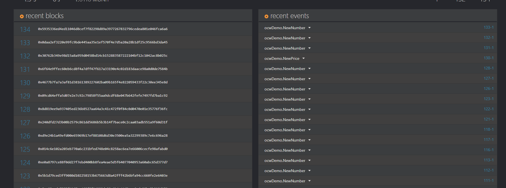
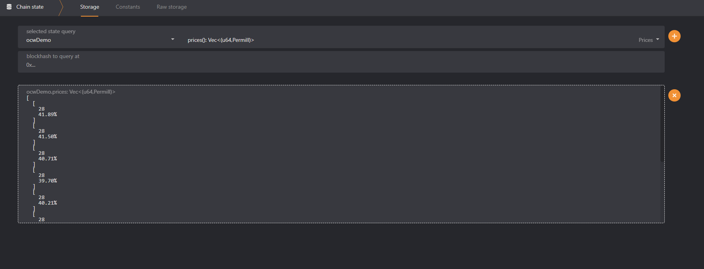
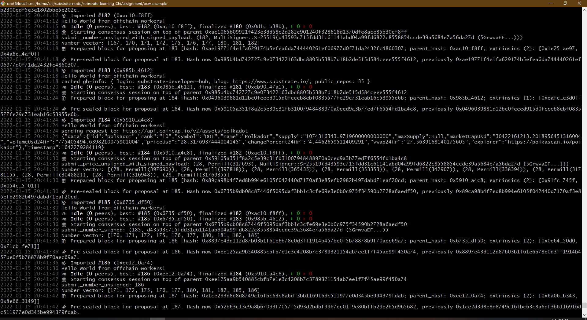

        @Author: 齐毅凡; team-1; No.84
        @language: rust
        @use: substrate v4.0
        @purpose: this repository was made for oneblock+ substrate blockchain learning
        @done: up to homework 4
* [oneblock+](https://twitter.com/oneblock_)
 ### homework 4 (in assignment)
* [assignment](./assignment/ocw-example)
* [screenshots](./homework_photo/advance/homework-4)
 ##### price update event

 ##### 10 latest price

 ##### runtime

