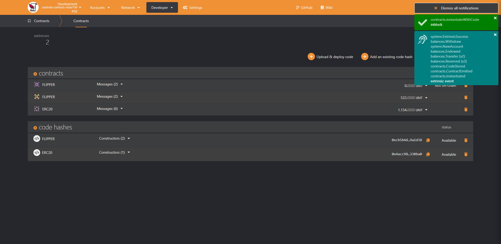
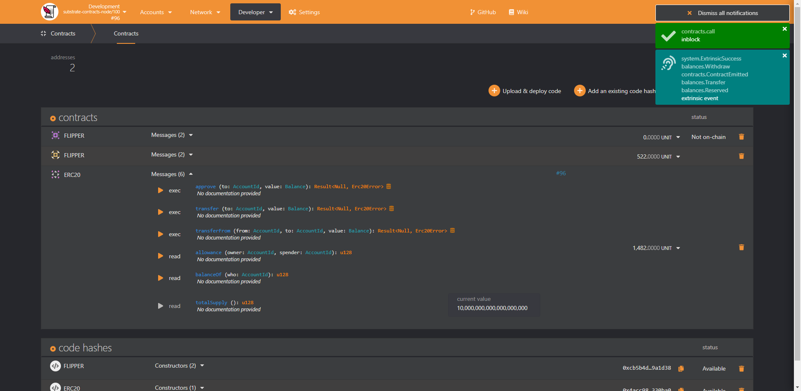
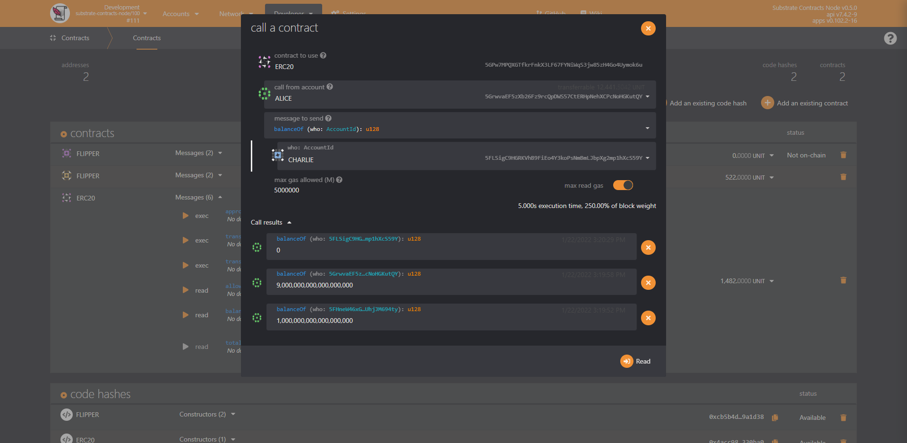
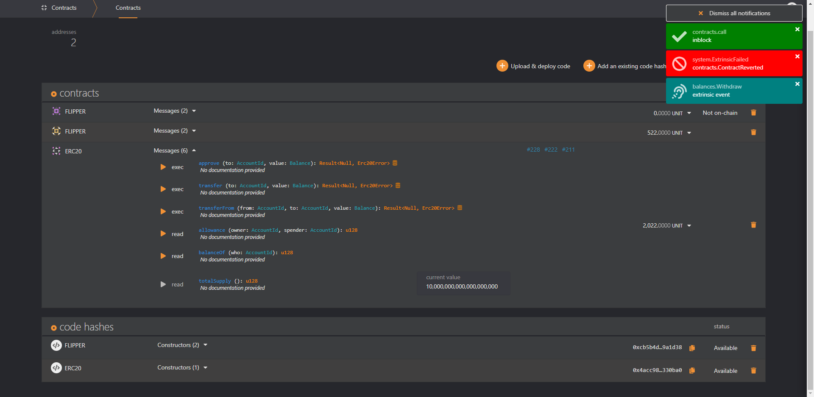
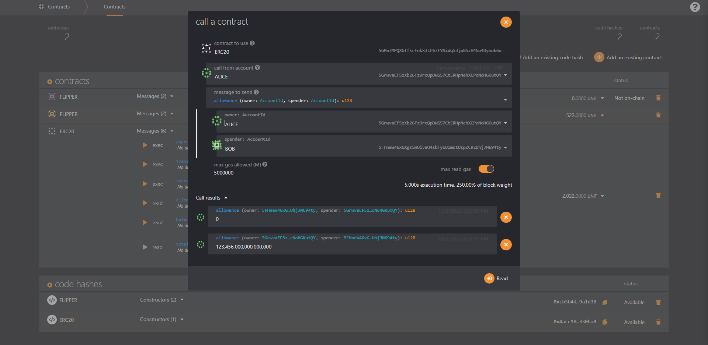
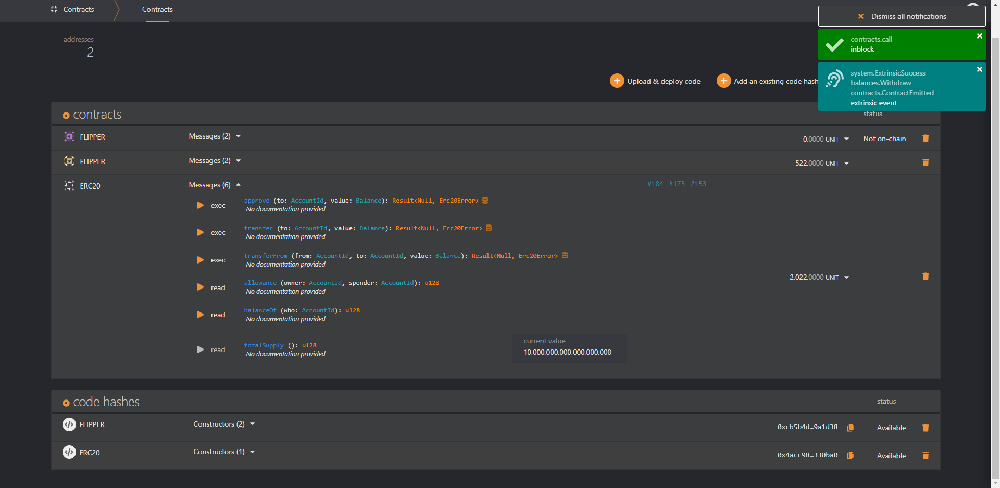
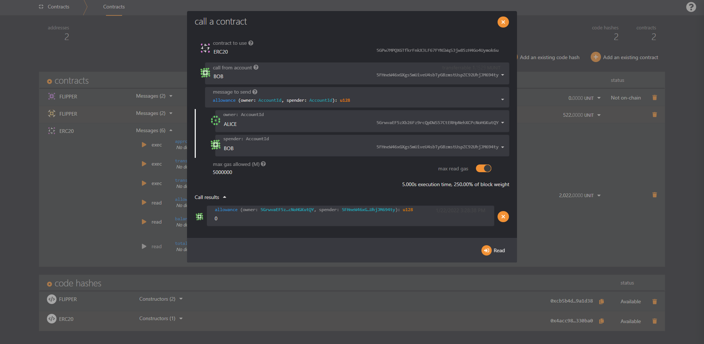
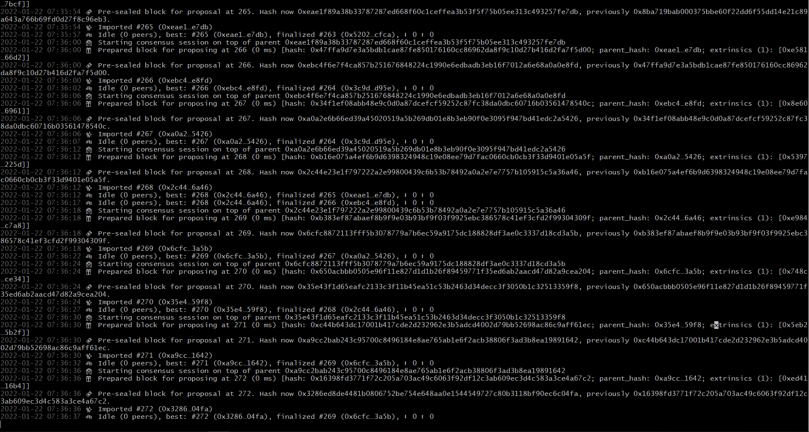

        @Author: 齐毅凡; team-1; No.84
        @language: rust
        @use: substrate v4.0
        @purpose: this repository was made for oneblock+ substrate blockchain learning
        @done: up to homework 5
* [oneblock+ twitter](https://twitter.com/oneblock_)
 ### homework 5
* [homework-5](./erc20)
* [homework-5-screenshots](./homework_photo/advance/homework-5)
 ##### deploy ink smart contract erc20
 
 ##### get balance
 
 ##### transfer event
 
 ##### transfer event: balance change
 
 ##### transfer error: over balance
 
 ##### get allowance
 
 ##### ask transfer event
 
 ##### ask transfer event: allowance change
 
 ##### ask transfer error: ask over allowance
 
 ##### node runtime
 

 ### past homework
* [homework-4](./assignment/ocw-example)
* [homework-4-screenshots](./homework_photo/advance/homework-4)
* [homework-3](./substrate-kitties-frontend/frontend)
* [homework-3-screenshots](./homework_photo/advance/homework-3)
* [homework-2](./substrate-kitties-monthly-2021-10)
* [homework-2-screenshots](./homework_photo/advance/homework-2)
